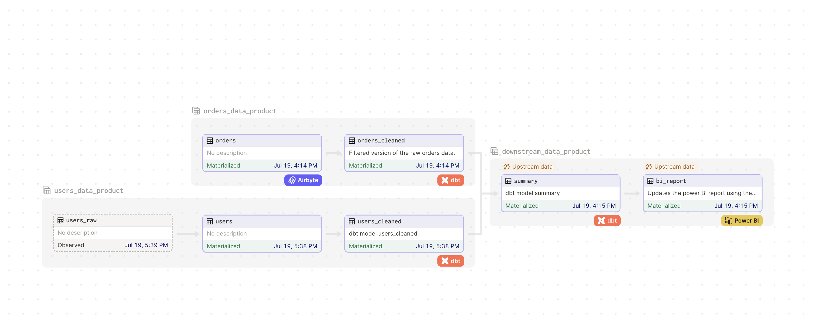

# Modern Data Stack + Observable Source Asset Demo

This demo is a fork of the [Dagster MDS example](https://github.com/dagster-io/dagster/tree/master/examples/assets_modern_data_stack) with the addition of an observable source asset, and downstream multi-asset sensors. 

The final result is a project structure like this:



To get started:

## Install the project

```
pip install -e ".[dev]"
```

## Setup postgres source

To keep things running on a single machine, we'll use a local postgres instance as both the source and the destination for our data. You can imagine the "source" database as some online transactional database, and the "destination" as a data warehouse (something like Snowflake).

To get a postgres instance with the required source and destination databases running on your machine, you can run:

```
$ docker pull postgres
$ docker run --name mds-demo -p 5432:5432 -e POSTGRES_PASSWORD=password -d postgres
$ PGPASSWORD=password psql -h localhost -p 5432 -U postgres -d postgres -c "CREATE DATABASE postgres_replica;"
```

## Airbyte

Now, you'll want to get Airbyte running locally. The full instructions can be found [here](https://docs.airbyte.com/deploying-airbyte/local-deployment), but if you just want to run some commands (in a separate terminal):

```
$ git clone https://github.com/airbytehq/airbyte.git
$ cd airbyte
$ docker-compose up
```

Once you've done this, you should be able to go to http://localhost:8000, and see Airbyte's UI, the default username is `airbyte` and the default password is `password`.

## Boostrap mock data

Now, you'll want to seed some data into the empty database you just created.

There's a script provided that should handle this all for you, which you can run with:

```bash
$ python -m dagster_proj.utils.setup_postgres
```

This script will also create the sample users data data/users.csv.

## Set up Airbyte connections

This example uses Dagster to [manage Airbyte ingestion as code](https://docs.dagster.io/guides/dagster/airbyte-ingestion-as-code).

To setup the Airbyte connections between the Postgres source and sink run:

```shell
dagster-airbyte apply --module dagster_proj.assets.airbyte_iaac:airbyte_reconciler
```

## Run Dagster

```shell
dagster dev
```

Open your browser to view the resulting assets. The job "sync_database" can be run to trigger the Airbyte sync and downstream run of the dbt model "orders_cleaned". This job is also set on a schedule to run daily on a cron schedule.

To trigger a run of the asset "users" and dbt model "users_cleaned" update the file data/users.csv. Updates to this file are tracked by the observable source asset "users_raw" and changes trigger the downstream dbt model "users_cleaned". The same pattern could be applied if you wanted to watch for new files in a directory or blob storage by modifying the code in the observable source asset.

When both "orders_cleaned" and "users_cleaned" have been updated the downstream model "summary" is run, along with the asset "bi_report". 

## Additional Features

The job to sync airbyte and run the "orders_cleaned" dbt model has a retry policy so the entire job can be retried in case of failure. The asset "bi_report" has a more specific retry policy so that it can be retried multiple times within one run if necessary.

The asset "summary" is run using a multi-asset sensor to track the upstream status of "orders_cleaned" and "users_cleaned". 